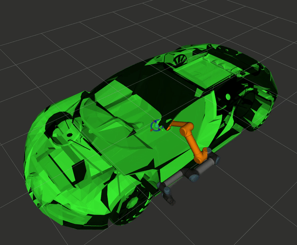

# Algorithm for Sensor-Based Robotics Project 3: Robotic Manipulator Motion Planning

This is a highlight of my implementation of an Expansive-Space Tree (EST) path planner. This project includes a simulation of a UR5 manipulator and a car, similar to what you'd find in an assembly line. The planner is used to compute a collision-free set of motions to move the robot from its initial configuration to a configuration where the end effector is near where the steering wheel should be.

The MoveIt! package is used to plan and execute the collision-free trajectory computed by my EST planner. The bulk of the packages required to set up the workspace were developed and provided by Dr. Simon Leonard at the Johns Hopkins University.    

## Expansive-Space Tree Planner

The EST planner is a **Single Query Sampling-based Planner**, similar to the more common Rapidly-exploring Random Tree planner (RRT). The difference lies in the way in which new nodes are selected. Whereas RRT's randomly selects a new configuration, EST's use a probability distribution of existing configurations to select a new configuration near the selected tree node configuration. The inverse of the number of degrees/nodes separating a leaf and the root is tracked for each leaf. These values are then normalized to obtain the probability distribution. This approach leads to a more even search of the configuration space.

The following demo shows a UR5 manipulator following a trajectory generated by the EST planner. The manipulator moves from it's home configuration to a configuration in which the end effector is close to the steering wheel.



## Running the project
#### Requirements
This project was built with ROS Kinetic on Ubuntu 16.04 (Xenial). In addition, the project requires the MoveIt! package. This package can be downloaded using the following commands:

```bash
sudo apt-get -y upgrade
sudo apt-get -y install ros-kinetic-moveit ros-kinetic-cmake-modules
```

#### Start the planner
To initialize the planner and the RVIZ environment, launch the planner launch file within the assignment3 package.
```bash
roslaunch assignment3 planner.launch
```
The launch file will start the necessary nodes for you to run the simulation.

Once the RVIZ node starts, go to the **Context** tab and select the CS463Planner. Then, go to the **Scene Objects** tab and select the Import from Text option to load the appropriate scene. The bugatti.scene file can be found within the meshes subdirectory in the assignment3 package. Click on the **Publish Scene** button to update the scene. Finally, go to the **Planning** tab to plan and execute trajectories for the UR5 manipulator.
