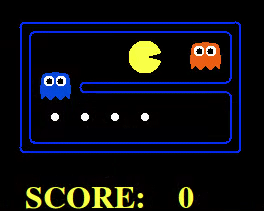

# Artificial Intelligence Project 2: Multi-Agent Search

This is a highlight of my implementation of 4 different agents for Multi-Agent. These are different from the default Search Agent used in Project 1.  
* Reflex Agent
* Minimax Agent
* Minimax with Alpha-Beta Pruning
* Expectimax Agent

The code is in a private repository for the purpose of maintaining academic integrity. The bulk of the code was created by John DeNero and Dan Klein at UC Berkeley (http://ai.berkeley.edu). Where necessary, the code was modified by the teaching staff at the Johns Hopkins University for the Artificial Intelligence Course. The implementation of the Reflex, Minimax, and Expectimax agents are my own.

## Running the code
The prompt for the project can be found [here](https://inst.eecs.berkeley.edu/~cs188/sp19/project2). The only prerequisite is having a Python 3 installation set up ready to go. All of the necessary files are included in the repository.

To begin, run pacman.py with an appropriate flag for map layout, agent, and maximum depth for the search tree.
```
python pacman.py -l LAYOUT -p AGENT -a depth=DEPTH.
```
My implementation of the different agents can be found in the **multiagent.py** file. All the available layouts can be found within the directory of the same name.

To run the code against the unit tests provided, run **autograder.py** as follows.
```
python autograder.py
```
In the following sections we evaluate the performance of the different agents in a more realistic game of Pac-man, ghosts included.

## Reflex Agents
Reflex agents are those that choose the best action available considering only the current state of the world they hold. They do not have the ability to consider the future consequences of the actions they take. A demo of what the Reflex Agent can do is showcased below:


This agent is able to successfully complete a game on some occasions. However, the reflex agent tends to get stuck towards the end of a game when there are few pellets left, remaining stationary until one of the ghosts comes close enough.

In order to improve our chances of winning when facing more complex adversaries, we must look to more powerful types of agents to solve this challenge.

## Minimax Agents
In the case of Minimax, we explore adversarial search agents. In this case, we set the game up as a zero-sum game where Pac-man attempts to maximize its score while the ghosts try to minimize Pac-man's score.

While this agent is more robust than a Reflex agent, it does not guarantee that Pac-man will always win. This limitation stems, in part, from the fact that we limit the max depth of the search tree that Pac-man and the ghosts use for improved performance.

#### Alpha-Beta Pruning
This is an improvement to the vanilla Minimax algorithm. By exploiting our knowledge that the ghosts always take the action that minimizes Pac-man's score, we can trim some of the leaves and not expand as many nodes. This leads to a more efficient agent that can explore search trees of a greater depth in the same amount of time.

A demo of the Minimax agent with alpha-beta pruning can be found below. In this case, we trade a more robust evaluation function in favor of improved runtime. The Reflex Agent above achieves a better score because its evaluation function is more robust, but faces simpler, sub-optimal adversaries. Notice that Pac-man sometimes stops moving and just waits around. This is due to the limitation of depth to 3 nodes imposed on the search tree. When it stops moving, Pac-man has no motivation since it can't see any of the remaining pellets (and does not necessarily have a notion of missing pellets, depending on the implementation), or because ghosts are not nearby.


## Expectimax Agents
One of the downsides of Minimax is that we assume that our agents are perfectly rational, always acting in a predictable way. In this case, Minimax works only when the Ghost's select the actions that minimize Pac-man's score.

In this case, Expectimax replaces the minimum evaluation function of traditional Minimax Ghosts in favor of a weighted average of all possible outcomes. The weighted average is computed using the score resulting from each possible action and the probability of the action being taken. In this particular implementation, the Ghosts select any action with the same probability.

As a way of demonstrating the power of Expectimax, I have a comparison of the Minimax and Expectimax agents when facing the same situation. In this case, Pac-man is trapped in a corridor with two sub-optimal (random) ghosts. The blue ghost can move towards Pac-man, trapping it, or move away, clearing a path for Pac-man to escape.

A **Minimax** agent will evaluate the initial situation and always move towards the nearest ghost. Since it is expecting to face optimal agents, it attempts to end the game as fast as possible in order to lose the least number of points.


In contrast, an **Expectimax** agent will always wait for the ghosts to move first before moving in any direction. If the blue ghost approaches, it employs a similar strategy as the Minimax agent above. If the blue ghost moves away, it moves in that direction. This allows it to avoid the orange ghost and collect the pellets.

 
