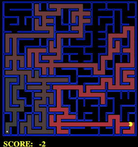
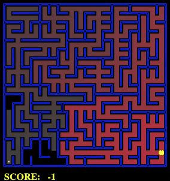
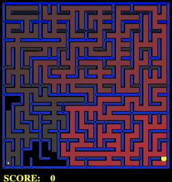
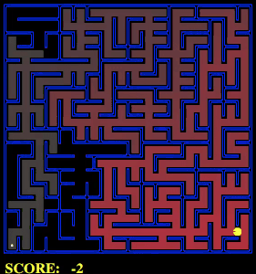
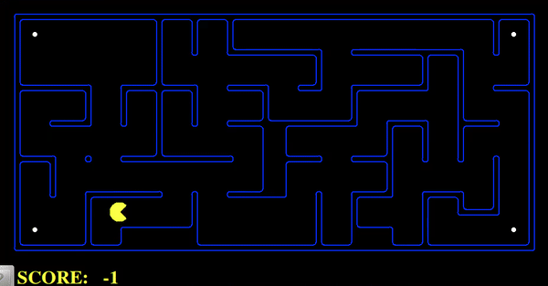
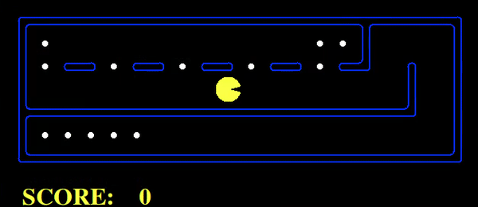
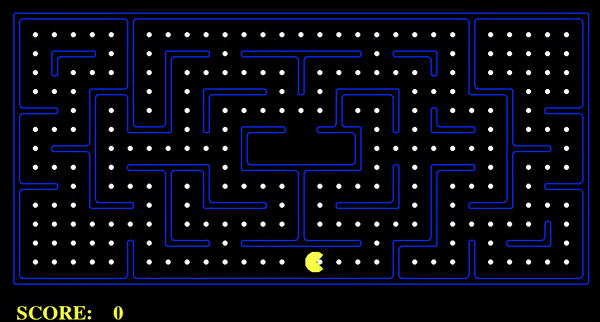

# Artificial Intelligence Project 1: Search Problems

This is a highlight of my implementation of several search algorithms and search agents applied to a game of Pac-man. The algorithms implemented are:
* Depth-First Search
* Breath-First Search
* Uniform Cost Search
* A* and Heuristics

The code is in a private repository for the purpose of maintaining academic integrity. The bulk of the code was created by John DeNero and Dan Klein at UC Berkeley (http://ai.berkeley.edu). Where necessary, the code was modified by the teaching staff at the Johns Hopkins University for the Artificial Intelligence Course. The implementation of the search algorithms, search agents, and heuristics are my own.

## Running the code
The prompt for the project can be found [here](https://gist.githubusercontent.com/PurpleBooth/109311bb0361f32d87a2/raw/8254b53ab8dcb18afc64287aaddd9e5b6059f880/README-Template.md). The only prerequisite is having a Python 3 installation set up ready to go. All of the necessary files are included in the repository.

To begin, run pacman.py with an appropriate flag for map layout, agent, and search algorithm. For the more advanced scenarios, the search problem is specified after the search algorithm. In the case of using the A* algorithm, the heuristic can be specified in the same manner.

```
python pacman.py -l LAYOUT -p AGENT -a fn=ALGO, [prob=PROBLEM, heuristic=HEUR].
```
My implementation of the four search algorithms, as well as of different types of Agents, can be found in the **search.py** and **searchAgents.py** files. All the available layouts can be found within the directory of the same name. The "Maze" layouts are designed for the simple SearchAgent with no problem specified. The rest of the layouts were designed to test the Agents and Search Problems that have similar names. For example, the "Corners" layouts are designed to test the CornersProblem, and in the case of the A* algorithm, the cornersHeurisitc.

To run the code against the unit tests provided, run **autograder.py** as follows.
```
python autograder.py
```

## Rational Agents
In this project, we are interested in developing and studying rational agents. These agents act to maximize their expected utility. In this particular case, the agents are motivated to perform the set of actions that will lead it to a high reward by collecting pellets. However, there is a "living cost" associated with each move. As you'll observe below, the score decreases as Pac-man makes it's way towards the goal because of this "living cost".

A short comparison of the performance of the 4 search algorithms used by our rational agents follows below.

## Solving the Maze
In this section we compare the performance of the four search algorithms when solving the bigMaze layout. The final score and a visual representation of the expanded nodes for each of the algorithms can be found below. The nodes expanded first have the greatest saturation, with the value decreasing as the agent expands more and more nodes.

Depth-First Search performs the best by expanding the least number of nodes. This occurs because of the relative simplicity of the problem. As we move forward with more complicated problems, we will be working with the more robust A* algorithm.

#### Depth-First Search

* 390 search nodes expanded

#### Breath-First Search

* 620 search nodes expanded

#### Uniform Cost Search

* 620 search nodes expanded

#### A* with Manhattan Distance Heuristic

* 549 search nodes expanded

## Finding all Corners
In order to explore the real power of A*, we formulated a more challenging problem. In this scenario, Pac-man must visit all four corners and collect pellets in a rational way. That is, maximizing its score.

To achieve this, I implemented a new **cornersProblem** to track the corners that Pac-man has yet to visit. In addition, I designed the admissible **cornersHeurisitc** by finding the maximum distance to any of the corners.

The resulting trajectory for this problem using A* with the cornersHeuristic can be found below.



## Collecting all the Food
In the spirit of getting our agent closer to playing a full game of Pac-man, we also explored the problem of collecting all the food. A* performs stupendously in a simple maze with more pellets. To achieve this, I designed the admissible **foodHeurisitc** by finding the maximum distance to any of the pellets, similar as before.



However, collecting all the pellets of a large maze is too complicated a task to be completed optimally by A* in a reasonable amount of time. Instead, I implemented a greedy search agent, forgoing optimality in favor of practicality. This agent can be observed in action in the following GIF.


